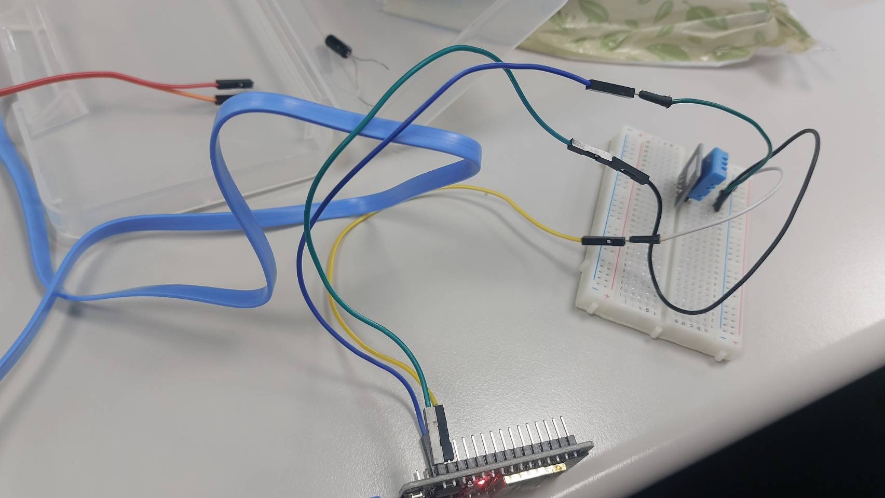
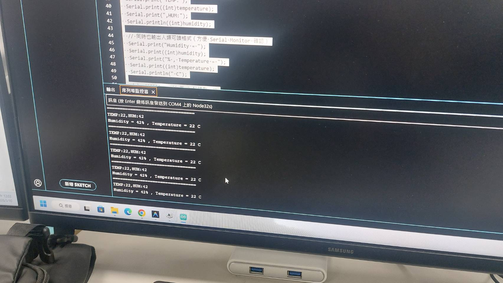
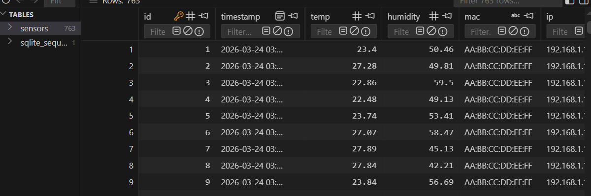
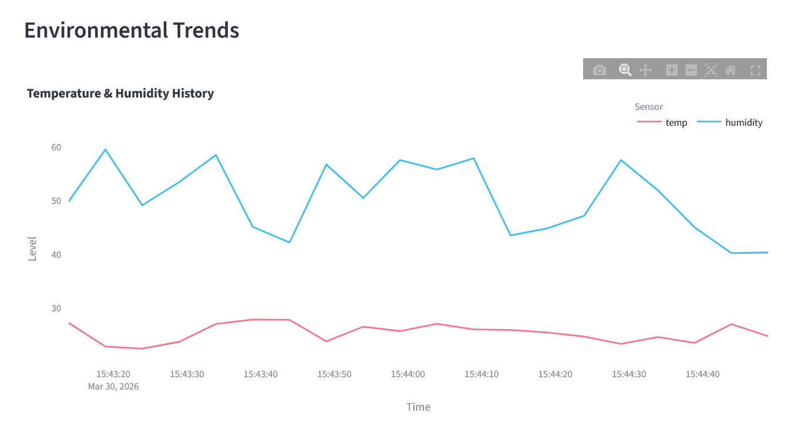
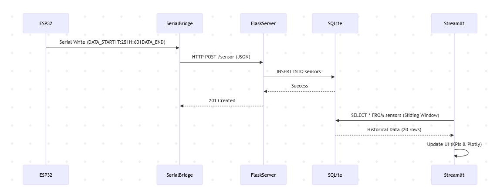

# AIoT_HW_Assignment

## 1. 準備工作

### (1) ESP32 定向數據輸出 (USB Serial)

ESP32 透過 USB Serial 介面將 DHT11 感測器數據以特定格式發送至電腦。

#### 程式碼 (`dht11_esp32.ino`)

```cpp
#include <WiFi.h>
#include <HTTPClient.h>
#include <SimpleDHT.h>

#define DHTPIN 25
SimpleDHT11 dht;

void setup() {
  Serial.begin(115200);
  Serial.println("ESP32 DHT11 AIoT Node Starting (USB Mode)...");
}

void sendViaUSB(float t, float h) {
  // 專為 Serial Bridge 設計的傳輸格式
  Serial.print("DATA_START|T:");
  Serial.print(t);
  Serial.print("|H:");
  Serial.print(h);
  Serial.println("|DATA_END");
}

void loop() {
  delay(2000); 

  byte temperature = 0;
  byte humidity = 0;
  if (dht.read(DHTPIN, &temperature, &humidity, NULL) == SimpleDHTErrSuccess) {
    sendViaUSB((float)temperature, (float)humidity);
  }
}
```

#### 輸出結果 (Arduino 監控窗)



使用 USB 連接成功時，序列埠監控窗輸出如下：



---

## 2. 搭建 Flask 應用與資料庫

### (1) 建立 Flask 基本架構與資料庫初始化 (`aiotdb.py`)

為了儲存長期的感測數據，我們使用 SQLite3 建立了一個簡單的資料庫結構。

#### `aiotdb.py` 內容

```python
import sqlite3
import os

DB_NAME = "aiotdb.db"

def setup_database():
    """Initialize database and create sensors table"""
    conn = sqlite3.connect(DB_NAME)
    cursor = conn.cursor()
    cursor.execute(f'''
        CREATE TABLE IF NOT EXISTS sensors (
            id INTEGER PRIMARY KEY AUTOINCREMENT,
            timestamp DATETIME DEFAULT CURRENT_TIMESTAMP,
            temp REAL NOT NULL,
            humidity REAL NOT NULL,
            mac TEXT,
            ip TEXT,
            device_name TEXT,
            type TEXT DEFAULT 'SIMULATED'
        )
    ''')
    conn.commit()
    conn.close()
    print(f"[DB] Database {DB_NAME} initialized.")

def insert_data(temp, humidity, mac=None, ip=None, device_name=None, data_type='SIMULATED'):
    """Insert sensor data with metadata into the database"""
    conn = sqlite3.connect(DB_NAME)
    cursor = conn.cursor()
    cursor.execute(
        "INSERT INTO sensors (temp, humidity, mac, ip, device_name, type) VALUES (?, ?, ?, ?, ?, ?)",
        (temp, humidity, mac, ip, device_name, data_type)
    )
    record_id = cursor.lastrowid
    conn.commit()
    conn.close()
    return record_id

if __name__ == "__main__":
    # Test code
    setup_database()
    rid = insert_data(25.5, 60.0, "AA:BB:CC:DD:EE:FF", "192.168.1.100", "Sim-Device")
    print(f"Test write successful, ID: {rid}")
```

### (2) 資料接收伺服器 (`esp32_sim_server.py`)

#### 程式碼

```python
import time
from flask import Flask, request, jsonify
import aiotdb

app = Flask(__name__)

# Initialize database on startup
aiotdb.setup_database()

@app.route("/health", methods=["GET"])
def health():
    """Health check endpoint"""
    return jsonify({"status": "ok", "timestamp": time.time()}), 200

@app.route("/sensor", methods=["POST"])
def sensor_data():
    """Endpoint to receive sensor data from ESP32 simulator"""
    try:
        data = request.get_json(force=True)
        if not data:
            return jsonify({"status": "error", "message": "No JSON data received"}), 400
        
        temp = data.get("temp")
        humidity = data.get("humidity")
        mac = data.get("mac")
        ip = data.get("ip")
        device_name = data.get("device_name")
        data_type = data.get("type", "SIMULATED")
        
        if temp is None or humidity is None:
            return jsonify({"status": "error", "message": "Missing temperature or humidity"}), 400
        
        record_id = aiotdb.insert_data(
            temp=float(temp),
            humidity=float(humidity),
            mac=mac,
            ip=ip,
            device_name=device_name,
            data_type=data_type
        )
        
        print(f"[Server] Data received from {device_name} ({mac}) [{data_type}]: Temp={temp}, Hum={humidity}")
        
        return jsonify({
            "status": "ok",
            "id": record_id,
            "message": "Data stored successfully"
        }), 201
        
    except Exception as e:
        print(f"[Error] Failed to process sensor data: {e}")
        return jsonify({"status": "error", "message": str(e)}), 500

if __name__ == "__main__":
    print("AIoT Flask Server starting on http://localhost:5000")
    app.run(host="0.0.0.0", port=5000, debug=False)
```

#### 資料庫內容


---

## 3. 數據傳輸

1. 我們開發了一個 **Serial Bridge** 程式，讀取 USB 輸出並轉發至 Flask Server。
2. 我們開發了模擬程式，隨機產生數值並轉發至 Flask Server。

### (1) Serial 橋接邏輯 (`serial_bridge.py`)

```python
import serial
import requests
import time
import re
import argparse

# --- Configuration ---
DEFAULT_SERIAL_PORT = "COM3"  # Change to your ESP32 serial port (e.g., /dev/ttyUSB0 on Linux)
BAUD_RATE = 115200
SERVER_URL = "http://localhost:5000/sensor"

def main():
    parser = argparse.ArgumentParser(description="AIoT Serial Bridge")
    _ = parser.add_argument("--port", type=str, default=DEFAULT_SERIAL_PORT, help="Serial port to connect to")
    args = parser.parse_args()
    
    SERIAL_PORT = str(args.port)
    print(f"[Bridge] Starting Serial Bridge on {SERIAL_PORT}...")
    
    ser = None
    try:
        ser = serial.Serial(SERIAL_PORT, BAUD_RATE, timeout=1)
        time.sleep(2)  # Wait for connection
        
        while True:
            if ser.in_waiting > 0:
                line = ser.readline().decode('utf-8').strip()
                print(f"[Serial] {line}")
                
                # Regex to match format DATA_START|T:25.5|H:60.0|DATA_END
                match = re.search(r"DATA_START\|T:([\d\.]+)\|H:([\d\.]+)\|DATA_END", line)
                if match:
                    temp = float(match.group(1))
                    hum = float(match.group(2))
                    
                    payload = {
                        "temp": temp,
                        "humidity": hum,
                        "mac": "USB-SERIAL",
                        "ip": "127.0.0.1",
                        "device_name": "ESP32-USB-Bridge",
                        "type": "REAL"
                    }
                    
                    try:
                        resp = requests.post(SERVER_URL, json=payload)
                        if resp.status_code == 201:
                            print(f"[Bridge] Data sent to server: T={temp}, H={hum}")
                        else:
                            print(f"[Error] Server returned {resp.status_code}")
                    except Exception as e:
                        print(f"[Error] Failed to send to server: {e}")
            
            time.sleep(0.1)
                
    except Exception as e:
        print(f"[Error] Serial port error: {e}")
    finally:
        if ser is not None and ser.is_open:
            ser.close()

if __name__ == "__main__":
    main()
```

### (2) 模擬程式

```python
import time
import requests
import random

SERVER_URL = "http://localhost:5000/sensor"
SEND_INTERVAL = 5  # seconds

# Simulated ESP32 Metadata
DEVICE_METADATA = {
    "mac": "AA:BB:CC:DD:EE:FF",
    "ip": "192.168.1.100",
    "device_name": "ESP32-DHT11-Sim"
}

def generate_sensor_data():
    """Simulate DHT11 temperature and humidity readings"""
    # Typical indoor range
    temp = round(random.uniform(22.0, 28.0), 2)
    humidity = round(random.uniform(40.0, 60.0), 2)
    return temp, humidity

def send_data():
    """Send simulated sensor data to the server via POST"""
    temp, humidity = generate_sensor_data()
    payload = {
        "temp": temp,
        "humidity": humidity,
        **DEVICE_METADATA
    }
    
    try:
        response = requests.post(SERVER_URL, json=payload, timeout=5)
        if response.status_code == 201:
            print(f"[Sim] Data sent successfully: Temp={temp}, Hum={humidity}")
        else:
            print(f"[Sim] Server returned error: {response.status_code} - {response.text}")
    except requests.exceptions.ConnectionError:
        print("[Sim] Error: Could not connect to server. Is it running?")
    except Exception as e:
        print(f"[Sim] Unexpected error: {e}")

if __name__ == "__main__":
    print(f"ESP32 Simulator starting. Sending to {SERVER_URL} every {SEND_INTERVAL}s")
    try:
        while True:
            send_data()
            time.sleep(SEND_INTERVAL)
    except KeyboardInterrupt:
        print("\n[Sim] Stopping simulator.")
```

---

## 4. 將資料渲染於網頁 (Streamlit)

我們使用 Streamlit 建立了一個動態更新的儀表板。

### 利用 Streamlit 呈現動態圖表 (`dashboard.py`)

```python
import streamlit as st
import pandas as pd
import sqlite3
import plotly.express as px
from streamlit_autorefresh import st_autorefresh

# Page configuration
st.set_page_config(
    page_title="AIoT Environmental Monitor",
    page_icon="🚀",
    layout="wide",
)

# Custom CSS for premium look and high contrast
_ = st.markdown("""
    <style>
    .main {
        background-color: #0f172a;
    }
    [data-testid="stMetricValue"] {
        color: #ffffff !important;
        font-size: 2.5rem !important;
        font-weight: 800 !important;
    }
    [data-testid="stMetricLabel"] {
        color: #94a3b8 !important;
        font-size: 1.1rem !important;
        letter-spacing: 0.05em !important;
        text-transform: uppercase !important;
    }
    .stMetric {
        background: linear-gradient(135deg, #1e293b 0%, #0f172a 100%);
        padding: 25px;
        border-radius: 12px;
        border: 1px solid rgba(255, 255, 255, 0.1);
        box-shadow: 0 4px 15px rgba(0, 0, 0, 0.3);
    }
    /* Specific accent colors for metrics */
    div[data-testid="stMetric"]:nth-child(1) { border-left: 5px solid #fb7185; }
    div[data-testid="stMetric"]:nth-child(2) { border-left: 5px solid #38bdf8; }
    div[data-testid="stMetric"]:nth-child(3) { border-left: 5px solid #a855f7; }
    </style>
    """, unsafe_allow_html=True)

# Database connection
def get_data():
    conn = sqlite3.connect("aiotdb.db")
    df = pd.read_sql_query("SELECT * FROM sensors ORDER BY timestamp DESC LIMIT 100", conn)
    conn.close()
    return df

# Auto-refresh control
refresh_rate_sec = st.sidebar.selectbox(
    "🔄 Refresh Rate",
    options=[1, 2, 5, 10, 30],
    index=2,  # Default to 5s
    format_func=lambda x: f"{x} seconds"
)
_ = st_autorefresh(interval=refresh_rate_sec * 1000, key="datarefresh")

_ = st.title("🚀 AIoT Environmental Monitor")
_ = st.markdown("---")

# Fetch data
df_all = get_data()

if df_all.empty:
    _ = st.info("No data available yet. Please ensure the ESP32 Simulator and Server are running.")
else:
    # Split into SIMULATED and REAL
    df_sim = df_all[df_all['type'] == 'SIMULATED']
    df_real = df_all[df_all['type'] == 'REAL']

    tab1, tab2 = st.tabs(["🎲 Random Data", "📡 Real Sensors"])

    with tab1:
        if df_sim.empty:
            st.warning("No simulated data yet.")
        else:
            # Latest data for KPIs
            latest = df_sim.iloc[0]
            
            # --- KPI Section ---
            col1, col2, col3 = st.columns(3)
            with col1:
                _ = st.metric("Temperature", f"{latest['temp']:.1f}°C")
            with col2:
                _ = st.metric("Humidity", f"{latest['humidity']:.1f}%")
            with col3:
                _ = st.metric("Last Updated", latest['timestamp'].split(" ")[1])

            st.markdown("---")
            
            # --- Chart ---
            fig = px.line(
                df_sim, 
                x="timestamp", 
                y=["temp", "humidity"],
                labels={"value": "Level", "timestamp": "Time", "variable": "Sensor"},
                color_discrete_map={"temp": "#fb7185", "humidity": "#38bdf8"},
                title="Simulated Trend",
                template="plotly_dark"
            )
            st.plotly_chart(fig, use_container_width=True)
            
            st.markdown("---")
            st.subheader("Recent Simulated Logs")
            st.dataframe(df_sim.head(20), use_container_width=True)

    with tab2:
        if df_real.empty:
            st.warning("No real sensor data yet. Connect your ESP32 via WiFi or USB Serial Bridge.")
        else:
            # Latest data for KPIs
            latest_r = df_real.iloc[0]
            
            # --- KPI Section ---
            col1, col2, col3 = st.columns(3)
            with col1:
                _ = st.metric("Real Temp", f"{latest_r['temp']:.1f}°C")
            with col2:
                _ = st.metric("Real Humidity", f"{latest_r['humidity']:.1f}%")
            with col3:
                _ = st.metric("Last Updated", latest_r['timestamp'].split(" ")[1])

            st.markdown("---")
            
            # --- Chart ---
            fig_r = px.line(
                df_real, 
                x="timestamp", 
                y=["temp", "humidity"],
                labels={"value": "Level", "timestamp": "Time", "variable": "Sensor"},
                color_discrete_map={"temp": "#fb7185", "humidity": "#38bdf8"},
                title="Real Sensor Trend",
                template="plotly_dark"
            )
            st.plotly_chart(fig_r, use_container_width=True)
            
            st.markdown("---")
            st.subheader("Real Sensor Logs")
            st.dataframe(df_real.head(20), use_container_width=True)
```

#### 儀表板顯示結果


---

## 5. 時序圖 (Sequence Diagram)

本專案的數據流如下圖所示，ESP32 透過 Serial Bridge 與 Flask Server 溝通，最終由 Streamlit 進行呈現。

